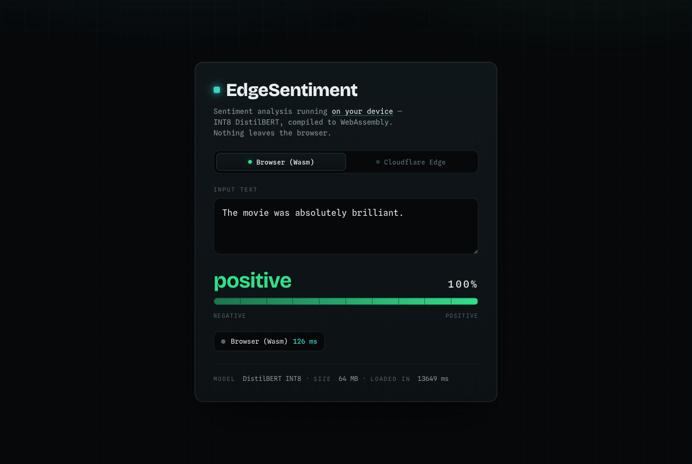
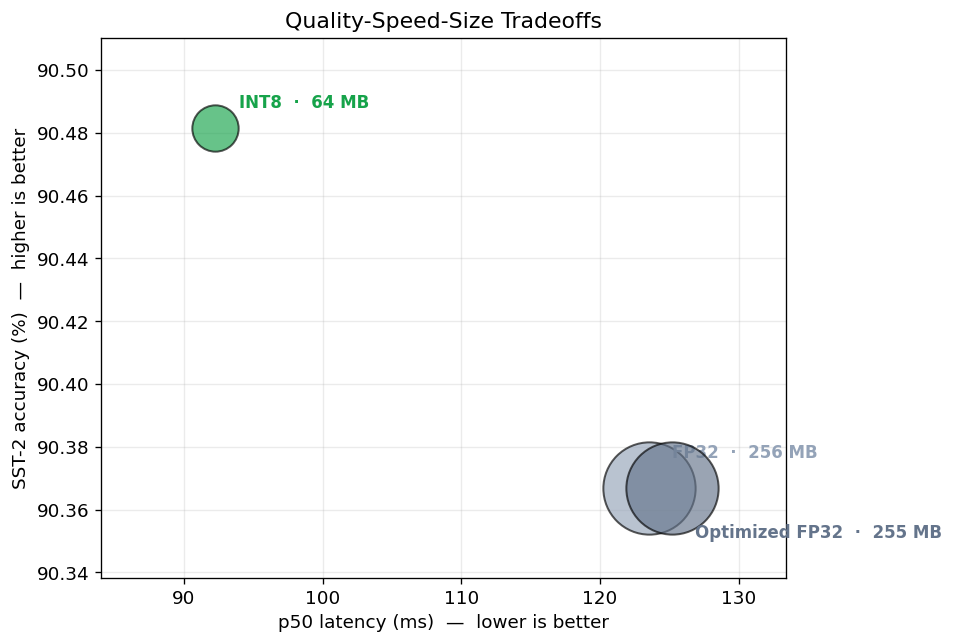
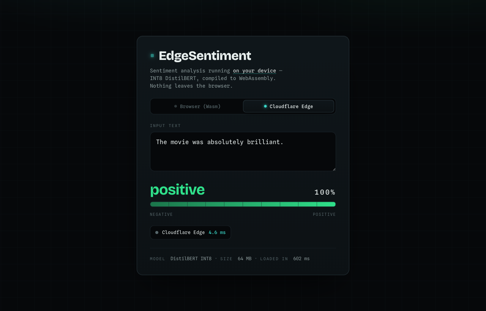
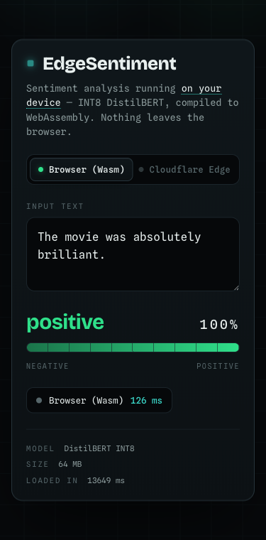

# EdgeSentiment

**Real-time sentiment analysis that runs on the edge — in the browser via WebAssembly and at a Cloudflare POP — from a single INT8-quantized DistilBERT.**

Live demo: _[add your deployment URL]_

<p align="center">
  
</p>

---

## What This Is

Most sentiment classifiers live behind a cloud API: every keystroke a user types is shipped to a datacenter, run on a rented GPU, and shipped back. At scale that design pays three structural taxes — **latency** (a datacenter round trip is 50–200 ms before the model even runs), **cost** (GPU inference servers scale linearly with traffic), and **privacy** (user text leaves the device and the network). Edge AI removes all three by moving the model to where the user is: their browser, or a CDN point-of-presence a few miles away. The hard part is fit — a 256 MB FP32 transformer is a non-starter in a browser tab or a 128 MB Worker isolate.

EdgeSentiment is the full pipeline that makes a transformer small and fast enough to deploy at the edge, end to end: fine-tune `distilbert-base-uncased` on SST-2, export to ONNX (with a verified numerical-parity check), graph-optimize and **INT8-quantize** it down to **64 MB (4× smaller, ~30% faster, no accuracy loss)**, then ship that exact same artifact to two deployment paths — an in-browser WebAssembly app, and a Cloudflare Worker edge gateway that fronts an off-loaded ONNX inference service. Every number in this README is measured, not estimated (see [`training/benchmark_results.json`](training/benchmark_results.json) and the [walkthrough notebook](training/notebooks/walkthrough.ipynb)).

## Architecture

```
                        ┌──────────────────────────────────────────────┐
                        │            TRAINING  (Google Colab T4)        │
                        └──────────────────────────────────────────────┘

   distilbert-base-uncased
            │
            ▼
   ┌──────────────┐   ┌──────────────┐   ┌──────────────┐   ┌──────────────┐
   │  Fine-tune   │──▶│   Export     │──▶│   Optimize   │──▶│  Quantize    │
   │  SST-2       │   │   → ONNX     │   │  (fuse BERT  │   │  INT8 dynamic│
   │  (Trainer)   │   │  opset 14    │   │   subgraphs) │   │  per-channel │
   │  90.4% acc   │   │  parity<1e-4 │   │   FP32       │   │  64 MB       │
   └──────────────┘   └──────────────┘   └──────────────┘   └──────┬───────┘
                                                                    │
                                       distilbert-sst2-int8.onnx    │
                                ┌───────────────────────────────────┴───────┐
                                ▼                                           ▼
                   ┌─────────────────────────┐               ┌─────────────────────────┐
                   │   BROWSER  (WebAssembly) │               │  CLOUDFLARE WORKER (TS)  │
                   │  onnxruntime-web · React │               │  edge gateway: CORS,     │
                   │  @xenova tokenizer       │               │  validation, logging     │
                   │  → on-device, 0 egress   │               │  proxies ↓ to            │
                   └─────────────────────────┘               └───────────┬─────────────┘
                                                                         ▼
                                                             ┌─────────────────────────┐
                                                             │   INFERENCE SERVICE      │
                                                             │  onnxruntime-node · TS   │
                                                             │  WordPiece tokenizer     │
                                                             │  runs the INT8 model     │
                                                             └─────────────────────────┘
```

**Why the Worker proxies instead of running the model itself:** onnxruntime-web's WebAssembly kernels can't be compiled or run inside Cloudflare's `workerd` runtime (no runtime Wasm compilation during a request, plus tight free-tier CPU/memory limits). So the Worker stays as the edge gateway — terminating requests at a Cloudflare POP, handling CORS, validation, and observability — and proxies the forward pass to a small Node service running `onnxruntime-node`, a native ONNX runtime with no such restrictions. The browser path has no such constraint and runs the model fully on-device.

## Benchmark Results

**Table 1 — Model variants.** Measured with `onnxruntime` (CPU EP, single-thread) at batch=1, seq_len=128, 200 warm-up + 500 measured runs on an Apple Silicon (arm64) machine. Accuracy is on the full SST-2 validation split (872 examples).

| Variant | Size | p50 Latency | p95 Latency | SST-2 Accuracy |
|---|---:|---:|---:|---:|
| FP32 (baseline) | 256 MB | 123.5 ms | 152.8 ms | 90.37% |
| Optimized FP32 | 255 MB | 125.2 ms | 134.0 ms | 90.37% |
| **INT8 (shipped)** | **64 MB** | **92.2 ms** | **94.8 ms** | **90.48%** |

INT8 is **4× smaller**, **~25% faster at p50** and **~38% faster at p95**, with **no accuracy loss** (it lands marginally above FP32, within run-to-run noise). The ONNX export was verified against PyTorch to a max absolute logit difference of **3.2e-5** (tolerance 1e-4).

<p align="center">
  
</p>

**Table 2 — Deployment comparison** (cost is order-of-magnitude, for ~1M requests/day).

| Backend | Latency | Privacy | Cost at 1M req/day |
|---|---|---|---|
| **Browser (Wasm)** | ~90–130 ms, on-device | On-device, **zero egress** | **$0** (runs on the client) |
| **Cloudflare Edge** | ~3–5 ms model\* + network RTT | Leaves browser, not the datacenter | Worker free tier + inference host |
| Traditional cloud API | ~200 ms+ | Leaves device **and** datacenter | ~$50–200 (GPU/CPU servers) |

\* The off-loaded `onnxruntime-node` service runs the INT8 model natively in ~3–5 ms (measured locally) — much faster than the WebAssembly path, since it's a native runtime. End-to-end latency is dominated by network RTT to the edge POP and the Worker→service hop. See [Limitations](#limitations) for why inference is off-loaded rather than run in the Worker.

<p align="center">
  
  <br><sub>The <b>Cloudflare Edge</b> backend: browser → Worker gateway → onnxruntime-node service → real prediction.</sub>
</p>

## Quick Start

```bash
git clone <your-repo-url> edge-sentiment
cd edge-sentiment
```

### 1. Train (Google Colab T4)

Training runs on a GPU, not locally.

1. Open [Google Colab](https://colab.research.google.com) and upload `training/train_colab.ipynb`.
2. `Runtime → Change runtime type → T4 GPU`.
3. `Run all` (~15–20 min). It saves the model to your Google Drive and zips it to `MyDrive/edge-sentiment/model.zip`.
4. Download and unzip so the model lives at `training/models/distilbert-sst2-finetuned/`.

### 2. Export → optimize → benchmark (local CPU)

```bash
cd training
python -m venv .venv && source .venv/bin/activate
pip install -r requirements.txt

python export.py      # ONNX export + PyTorch parity check  → "EXPORT VERIFIED"
python optimize.py    # graph opt + INT8 quant + accuracy    → "MODEL COPIED TO WEB"
python benchmark.py   # p50/p95/p99 latency → benchmark_results.json
```

`optimize.py` automatically copies the INT8 model into `web/public/model/`.

### 3. Run the browser demo

```bash
cd web
npm install
npm run dev          # http://localhost:5173
```

### 4. Run the edge path (Worker + inference service)

Start the inference service (runs the INT8 model via onnxruntime-node):

```bash
cd inference-service
npm install
npm start            # serves on http://localhost:8099
```

Then the Worker gateway, pointed at it:

```bash
cd worker
npm install
echo 'INFERENCE_URL=http://localhost:8099' > .dev.vars
npm run dev          # wrangler dev on http://localhost:8787
```

Point the web app at the Worker — `echo 'VITE_WORKER_URL=http://localhost:8787' > web/.env.local` — restart `npm run dev`, and toggle **Cloudflare Edge** in the UI to see real predictions over the full edge path.

**Deploying:** `wrangler deploy` the Worker and set `INFERENCE_URL` (a `[vars]` entry or secret) to your hosted inference service — any runtime that supports ONNX works (a container, Fly.io, Render, a small VM). The service reads the model from `MODEL_PATH` (defaults to the repo's INT8 model).

## Key Technical Decisions

- **DistilBERT, not BERT-base.** DistilBERT retains ~97% of BERT-base's GLUE quality at ~40% fewer parameters and ~60% faster inference. For an edge target where the model must download to a browser and run in real time, that size/speed trade is decisive — and SST-2 sentiment doesn't need BERT-base's extra capacity (we hit 90.4%).

- **INT8 *dynamic* quantization, not static.** Dynamic quantization computes activation scales per-inference, so it needs **no calibration dataset** and handles variable-length user text naturally. Static quantization can be marginally faster but requires a representative calibration set and tuning. We pair dynamic quantization with **per-channel** weight scales, which recovers the small accuracy loss naive per-tensor quantization incurs — here INT8 matches FP32 exactly.

- **Cloudflare Workers, not Lambda@Edge.** Workers run on V8 isolates with ~0 ms cold starts at 300+ POPs, versus Lambda@Edge's container cold starts and CloudFront coupling. Workers also expose first-class static assets and R2 object storage, which is how the 64 MB model is served (it exceeds both the 10 MB script limit and the 25 MB asset limit).

- **ONNX, not TorchScript, for the browser.** `onnxruntime-web` is a mature, well-optimized WebAssembly runtime with SIMD support; there is no comparable in-browser TorchScript runtime. ONNX also decouples the model from PyTorch entirely, so the *same* artifact runs in the browser, in the Worker, and in the Python benchmark.

## Limitations

This is a sentiment classifier, and a deliberately small one. DistilBERT-on-SST-2 handles short, opinionated English text well, but it is not a general language model: sarcasm, mixed/contrastive sentiment ("the acting was great but the plot dragged"), domain-specific jargon, non-English text, and long documents all degrade accuracy. Tasks that need world knowledge, multi-sentence reasoning, or nuanced classification call for a larger model — at which point the edge-deployment math changes and a server-side model (or a small LLM) is the right tool.

On the Cloudflare edge path: the project deliberately does **not** run the ONNX model inside the Worker, because onnxruntime-web's WebAssembly kernels can't be compiled or run in Cloudflare's `workerd` runtime (no runtime Wasm compilation during a request; free-tier limits of 10 ms CPU / 128 MB are also too tight for a ~90 ms / 64 MB BERT pass). Instead the Worker is a thin edge gateway that proxies to an off-loaded `onnxruntime-node` service — the standard pattern for serving a model too heavy for an edge isolate. That service is a single point that must be hosted somewhere ONNX runs; the trade is reliability and using the project's exact fine-tuned weights, at the cost of one extra hop versus pure in-isolate inference. The **browser backend has no such dependency** — it runs the full model on-device, verified end-to-end (see `docs/`).

---

<p align="center">
  
</p>
<p align="center"><sub>Fully responsive — verified at 375px.</sub></p>
